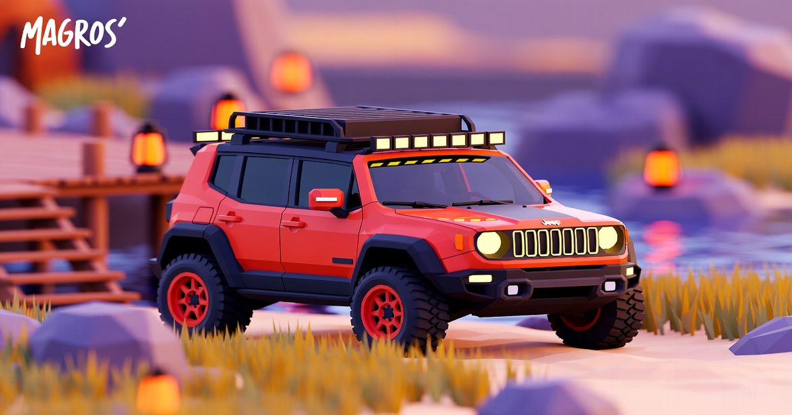

# Folio 2019 (Magros Zapatero)

3D portfolio / Time Machine build running on Three.js + Vite. Originally a Bruno Simon folio, personalized with the "Magros Zapatero" project content — including a projects section populated with **46 videos** from the author's YouTube playlist.

> Remote: `https://github.com/majinmagros/portfolio-magros.git` (branch `master`)



## Features

- Interactive 3D scene with intro, car tour, projects, achievements ("distinctions"), and more.
- **Projects section**: 46 videos, each with its own generated floor texture (title + short description) and a YouTube thumbnail — click **OPEN** to open the corresponding video.
  - Assets per video live in `static/models/projects/<video-id>/` (`floorTexture.png` + `slideA.jpg`).
  - Video metadata is sourced from the playlist `PLiIX1vnlWWNEFPed7oDm38alCAH0oyJek`.
- GLSL shaders for boards (see `src/javascript/shaders/`).
- Side-scrolling "tiles" connecting projects.
- Debug helpers via `dat.gui`.

## Setup

Install [Node.js](https://nodejs.org/en/download/) and run:

```bash
# Install dependencies
npm install

# Serve locally (vite dev server)
npm run dev

# Build for production into the dist/ directory
npm run build
```

Config in `vite.config.js`:
- `root: src/` (entry `src/index.html`), `publicDir: ../static/`.
- `build.outDir: '../dist'`, `emptyOutDir: true`, `sourcemap: true`.
- `server.host: true` (exposes on local network).

## Project structure

```
folio-2019/
├─ src/
│  ├─ index.html
│  ├─ javascript/     # application code (World, Sections, Materials, Utils, shaders)
│  ├─ shaders/         # GLSL shaders
│  ├─ style/
│  ├─ images/
│  └─ favicon/
├─ static/
│  ├─ models/          # 3D assets (GLB), textures, project videos & floor textures
│  └─ favicon/         # site manifest / icons
├─ resources/          # raw assets (not served)
└─ vite.config.js
```

## Projects data (reusable)

The pipeline that builds the 46-video project data, floor textures and thumbnails is captured in
`playlist-tools` (see project notes). Dataset available as `projects_data_final.json` with
`{ id, title, desc, short, url }` per video.

Integration points:
- `src/javascript/Resources.js` — per-video floor texture: `{ name: 'projectsVidNFloor', source: './models/projects/<id>/floorTexture.png', type: 'texture' }`.
- `src/javascript/World/Sections/ProjectsSection.js` — `setList()` defines each project (name, imageSources, floorTexture, link).

## Key dependencies

Three.js, cannon, gsap, howler, dat.gui, vite (v5), vite-plugin-glsl, vite-plugin-restart.

---
*Docs generated with verified facts from the repository (package.json, vite.config, folders, git remote/branch).*